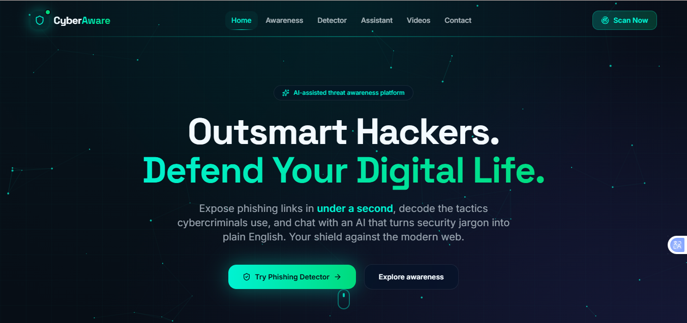
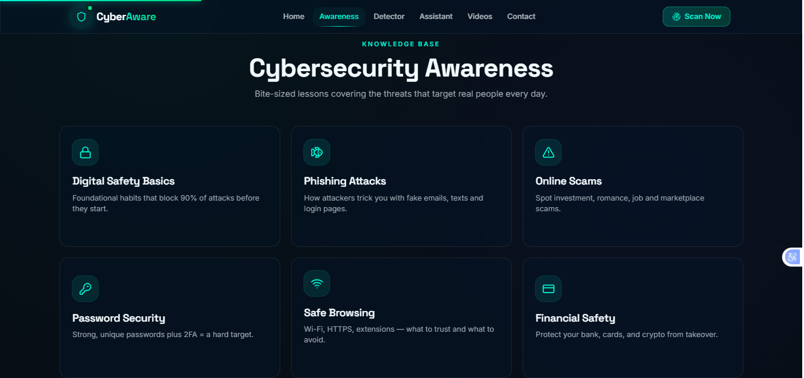

# 🛡️ CyberAware — Empowering Safe Digital Behavior Through Cybersecurity Education


> An interactive cybersecurity awareness platform designed to educate users about online threats, digital safety, and cybersecurity best practices.


---


## 🌟 Overview


CyberAware is a modern cybersecurity awareness web application designed to educate users about online threats, digital safety, and cybersecurity best practices.


It helps users understand common cyber risks like phishing, malware, and social engineering through a simple, interactive learning experience.


---


## 🎯 Problem Statement


Millions of users face cybersecurity threats daily due to lack of awareness.


Common threats include:

- 🎣 Phishing attacks

- 🕵️ Social engineering scams

- 🔐 Weak passwords

- 🦠 Malware infections

- 📊 Data breaches

- 🌐 Unsafe browsing


CyberAware helps users stay safe online through awareness and education.


---


## 📸 Screenshots


### Home Page





### Cyber Awareness Section





---


## ✨ Features


- Modern responsive UI

- Cybersecurity awareness modules

- Interactive learning experience

- Mobile-friendly design

- Fast performance

- Clean navigation

- Beginner-friendly content


---


## 🛠️ Tech Stack


| Technology | Purpose |

|------------|----------|

| React | Frontend |

| TypeScript | Type safety |

| Vite | Build tool |

| Tailwind CSS | Styling |

| TanStack Router | Routing |


---


## 🏗️ System Architecture


```text

User

 │

 ▼

CyberAware Web App

 │

 ▼

Cybersecurity Learning Modules

 │

 ▼

Interactive Awareness Experience

```


---


## 📂 Project Structure


```text

src/

├── components/

├── routes/

├── lib/

├── server.ts

└── start.ts

```


---


## 🌐 Live Demo


🔗 Live Project: (Add your Vercel link here)


---


## 👥 Team


| Member | Role |

|--------|------|

| Muhammad Ali | Frontend & UI |

| Muhammad Hamza | Research & Content |

| Ali Afzal | QA & Support |


---


## 🚀 Future Plans


- Cybersecurity quizzes

- AI phishing detector

- User progress tracking

- Security alerts system

- Multi-language support


---


## 👨‍💻 Author


**Muhammad Ali**


- GitHub: https://github.com/Alimemonnn

- LinkedIn: https://www.linkedin.com/in/muhammad-ali-95436038b


---


## ⭐ Support


If you like this project:

- ⭐ Star the repository

- 🍴 Fork it

- 📢 Share it


---


**Made with ❤️ for Indus Week 2026 Hackathon**

